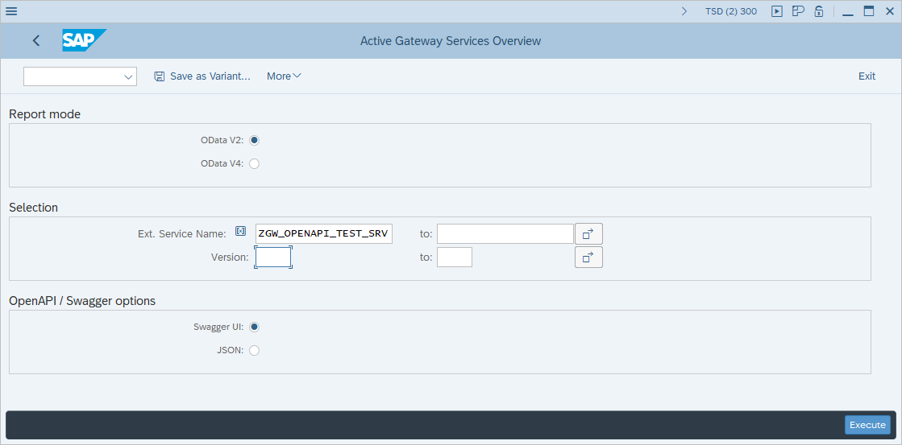
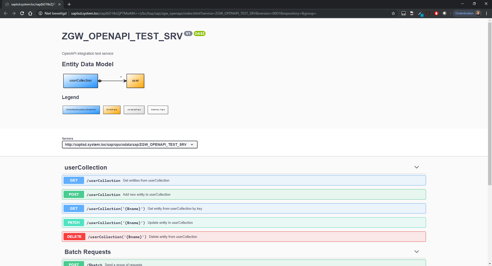

# ABAP OpenAPI UI
OpenAPI / Swagger UI integration for SAP NetWeaver Gateway

# Installation
1.  Install this repository using [abapGit](https://github.com/larshp/abapGit)
2.  Run transaction ZGW_OPENAPI

# FAQ
For questions, bugs or feature requests please create an [issue](https://gitlab.com/geertjanklaps/abap-openapi-ui/issues)

# Contributing
Check the contributing / development guidelines [here](CONTRIBUTING.md)

Discussions and suggestions can be added to the [Slack Group](https://abap-openapi-ui.slack.com)

# Credits
ABAP OpenAPI UI is based on 2 open source projects:
*  [Swagger UI](https://github.com/swagger-api/swagger-ui)
*  [Odata-OpenAPI](https://github.com/oasis-tcs/odata-openapi)

The ABAP OpenAPI UI code is automatically checked and validated by [abaplint](https://github.com/abaplint/abaplint).

This personal project was started (and is still being maintained) on a development system provided by:
